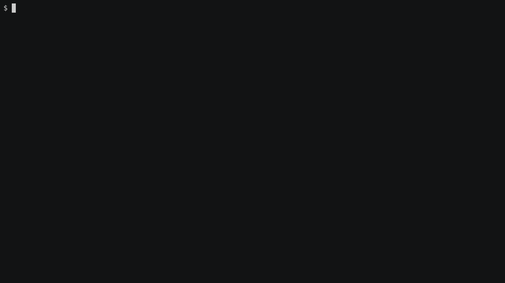

# taiko screencheck


## Installation

`npm install taiko-screencheck`

## Introduction



taiko-screencheck is a taiko plugin that assists visual regression testing by tracking changes to screenshots. It introduces a `screencheck` method that has the same signature as the built-in `screenshot` method, except that it returns the result of comparing this screenshot to a reference screenshot normally stored in a subdirectory of the the working directory.

By default `taiko-screencheck` will automatically create a directory for screenshots whenever taiko is loaded. It is recommended that test developers use the `screenshotSetup` method to override this behaviour with information particular to a given test run.

## Taiko Methods

### screencheck()
```typescript
screencheck(screenshotOptions = {}) => { 
   result:string = "SAME" | "DIFFERENT" | "NO_BASE_IMAGE",
   data:Buffer, referenceData:Buffer = undefined, pixelCount:number 
}
```

This method takes and saves a screenshot, and compares it to the reference screenshot to the equivalent screenshot in the detected or configured reference run (see screencheckSetup).

The value of `result` indicates whether or not the screenshots differ.

Taiko CLI example:

```
await openBrowser()
await goto("dcdc.io")
homepage = await screencheck()
assert.equal(homepage.result, "SAME")
```

### screencheckSetup()
```typescript
screencheckSetup(options = { 
   runId:string = <auto>, refRunId:string = <auto>, baseDir:string = <cwd>
}) => options
```

This method optionally configures screencheck to use custom directories for output and comparison.

## FAQs

1. My headless screen captures never match my headed screen captures of the same page.
   This may be happening because you have a high DPI display. Try setting your desktop as a 1:1 pixel ratio to your display device. Alternatively you may want to avoid headed mode for the creation of reference images.

## Contributing

Clone the git repository and use the `_test_harness` subdirectory to test the plugin in the taiko environment. The repository includes a Visual Studio Code configuration for debugging in a taiko context.

```bash
git clone https://github.com/dcdc-io/taiko-screencheck
cd taiko-screencheck
npm install
npm run build
npm run test
```

